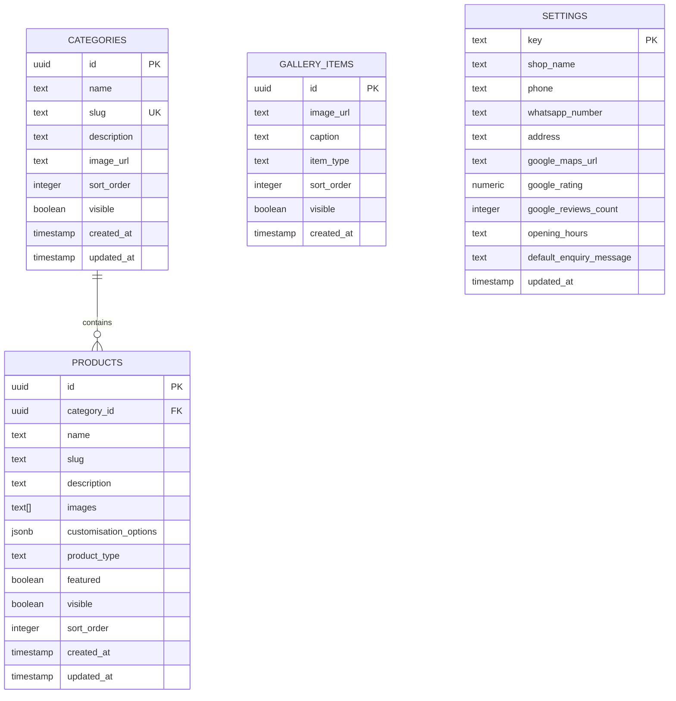

# Data Model & Supabase Schema
## INHOME FURNITURE Catalogue Architecture

**Version:** 1.0.0  
**Database Engine:** PostgreSQL 15+ (Hosted on Supabase)  
**Storage Engine:** Supabase Storage (`catalogue-images` public bucket)  
**Authentication:** Supabase Auth (Admin Role)  

---

## 1. Schema Design Principles

1. **Strict Data-Driven Categories:** Categories and products are never hard-coded in Next.js components. When a new category is added through the admin panel, it renders dynamically in grids, navigation, and sitemaps.
2. **Deterministic Slugs:** Slugs are validated, lowercase, URL-friendly strings (`^[a-z0-9-]+$`) supporting the canonical URL hierarchy: `/[category-slug]/[product-slug]`.
3. **Public Read, Authenticated Write (RLS):** Read operations are open to anonymous visitors for published content (`visible = true`). Mutations (INSERT, UPDATE, DELETE) are strictly protected by Supabase Row-Level Security (RLS) and restricted to authenticated admin sessions.
4. **Flexible Customisation Fields:** Furniture customisation attributes (dimensions, wood varieties, finish styles, fabric options) are stored in structured JSONB format with fallbacks for simple text.

---

## 2. Entity-Relationship Diagram (ERD)



---

## 3. SQL DDL Migration Script

The following SQL script creates all tables, triggers, indexes, and initial configuration on Supabase:

```sql
-- ============================================================================
-- INHOME FURNITURE — SUPABASE DATABASE SCHEMA MIGRATION
-- ============================================================================

-- Enable UUID extension
CREATE EXTENSION IF NOT EXISTS "uuid-ossp";

-- 1. CATEGORIES TABLE
CREATE TABLE IF NOT EXISTS public.categories (
    id UUID PRIMARY KEY DEFAULT uuid_generate_v4(),
    name TEXT NOT NULL,
    slug TEXT NOT NULL UNIQUE,
    description TEXT,
    image_url TEXT,
    sort_order INT NOT NULL DEFAULT 0,
    visible BOOLEAN NOT NULL DEFAULT true,
    created_at TIMESTAMPTZ NOT NULL DEFAULT NOW(),
    updated_at TIMESTAMPTZ NOT NULL DEFAULT NOW()
);

-- 2. PRODUCTS TABLE
CREATE TABLE IF NOT EXISTS public.products (
    id UUID PRIMARY KEY DEFAULT uuid_generate_v4(),
    category_id UUID REFERENCES public.categories(id) ON DELETE SET NULL,
    name TEXT NOT NULL,
    slug TEXT NOT NULL,
    description TEXT,
    images TEXT[] NOT NULL DEFAULT '{}',
    customisation_options JSONB NOT NULL DEFAULT '{
        "wood_types": ["Teak Wood", "Country Wood", "Rosewood Finish"],
        "sizes": ["Standard", "Custom Room Dimensions"],
        "finishes": ["Natural Matte", "Teak Brown Gloss", "Dark Walnut"],
        "fabrics": []
    }'::jsonb,
    product_type TEXT NOT NULL DEFAULT 'made_to_order' 
        CHECK (product_type IN ('made_to_order', 'ready_stock')),
    featured BOOLEAN NOT NULL DEFAULT false,
    visible BOOLEAN NOT NULL DEFAULT true,
    sort_order INT NOT NULL DEFAULT 0,
    created_at TIMESTAMPTZ NOT NULL DEFAULT NOW(),
    updated_at TIMESTAMPTZ NOT NULL DEFAULT NOW(),
    CONSTRAINT unique_category_product_slug UNIQUE (category_id, slug)
);

-- 3. GALLERY ITEMS TABLE
CREATE TABLE IF NOT EXISTS public.gallery_items (
    id UUID PRIMARY KEY DEFAULT uuid_generate_v4(),
    image_url TEXT NOT NULL,
    caption TEXT,
    item_type TEXT NOT NULL DEFAULT 'finished_work' 
        CHECK (item_type IN ('showroom', 'finished_work', 'new_arrival')),
    sort_order INT NOT NULL DEFAULT 0,
    visible BOOLEAN NOT NULL DEFAULT true,
    created_at TIMESTAMPTZ NOT NULL DEFAULT NOW()
);

-- 4. SHOP SETTINGS TABLE (Singleton key-value store)
CREATE TABLE IF NOT EXISTS public.settings (
    key TEXT PRIMARY KEY DEFAULT 'general',
    shop_name TEXT NOT NULL DEFAULT 'INHOME FURNITURE',
    phone TEXT NOT NULL DEFAULT '+919999999999',           -- ⚠️ PLACEHOLDER: replace with real number from Google listing before launch
    whatsapp_number TEXT NOT NULL DEFAULT '919999999999',  -- ⚠️ PLACEHOLDER: same real number, digits only (91 + 10 digits)
    address TEXT NOT NULL DEFAULT 'TCL Tower, 3/43A, Chennimalai Rd, Kangeyam, Tamil Nadu 638701',
    google_maps_url TEXT NOT NULL DEFAULT 'https://maps.google.com/?q=INHOME+FURNITURE+Kangeyam',
    google_rating NUMERIC(2, 1) NOT NULL DEFAULT 4.8,
    google_reviews_count INT NOT NULL DEFAULT 23,
    opening_hours TEXT NOT NULL DEFAULT 'Mon - Sat: 9:00 AM - 6:00 PM',  -- ⚠️ Opening time TBD; closing time 6 PM confirmed
    default_enquiry_message TEXT NOT NULL DEFAULT 'Hi INHOME Furniture, I like this design. Please share custom quote details.',
    updated_at TIMESTAMPTZ NOT NULL DEFAULT NOW()
);

-- ============================================================================
-- AUTOMATIC UPDATED_AT TIMESTAMP TRIGGER
-- ============================================================================

CREATE OR REPLACE FUNCTION public.set_updated_at()
RETURNS TRIGGER AS $$
BEGIN
    NEW.updated_at = NOW();
    RETURN NEW;
END;
$$ LANGUAGE plpgsql;

CREATE TRIGGER trg_categories_updated_at
BEFORE UPDATE ON public.categories
FOR EACH ROW EXECUTE FUNCTION public.set_updated_at();

CREATE TRIGGER trg_products_updated_at
BEFORE UPDATE ON public.products
FOR EACH ROW EXECUTE FUNCTION public.set_updated_at();

CREATE TRIGGER trg_settings_updated_at
BEFORE UPDATE ON public.settings
FOR EACH ROW EXECUTE FUNCTION public.set_updated_at();

-- ============================================================================
-- PERFORMANCE & LOOKUP INDEXES
-- ============================================================================

CREATE INDEX IF NOT EXISTS idx_categories_slug ON public.categories (slug);
CREATE INDEX IF NOT EXISTS idx_categories_visible_order ON public.categories (visible, sort_order);
CREATE INDEX IF NOT EXISTS idx_products_category_id ON public.products (category_id);
CREATE INDEX IF NOT EXISTS idx_products_slug ON public.products (slug);
CREATE INDEX IF NOT EXISTS idx_products_visible_order ON public.products (visible, sort_order);
CREATE INDEX IF NOT EXISTS idx_products_featured ON public.products (featured) WHERE featured = true;
CREATE INDEX IF NOT EXISTS idx_gallery_type_visible ON public.gallery_items (item_type, visible, sort_order);

-- ============================================================================
-- ROW-LEVEL SECURITY (RLS) POLICIES
-- ============================================================================

ALTER TABLE public.categories ENABLE ROW LEVEL SECURITY;
ALTER TABLE public.products ENABLE ROW LEVEL SECURITY;
ALTER TABLE public.gallery_items ENABLE ROW LEVEL SECURITY;
ALTER TABLE public.settings ENABLE ROW LEVEL SECURITY;

-- 1. Anonymous Public Read Policies
CREATE POLICY "Allow public read for visible categories" 
ON public.categories FOR SELECT 
USING (visible = true);

CREATE POLICY "Allow public read for visible products" 
ON public.products FOR SELECT 
USING (visible = true);

CREATE POLICY "Allow public read for visible gallery" 
ON public.gallery_items FOR SELECT 
USING (visible = true);

CREATE POLICY "Allow public read for settings" 
ON public.settings FOR SELECT 
USING (true);

-- 2. Authenticated Admin Full CRUD Policies
CREATE POLICY "Allow authenticated full access to categories" 
ON public.categories FOR ALL 
TO authenticated 
USING (true) WITH CHECK (true);

CREATE POLICY "Allow authenticated full access to products" 
ON public.products FOR ALL 
TO authenticated 
USING (true) WITH CHECK (true);

CREATE POLICY "Allow authenticated full access to gallery" 
ON public.gallery_items FOR ALL 
TO authenticated 
USING (true) WITH CHECK (true);

CREATE POLICY "Allow authenticated full access to settings" 
ON public.settings FOR ALL 
TO authenticated 
USING (true) WITH CHECK (true);
```

---

## 4. Initial Seed Data (17 Confirmed Categories)

```sql
INSERT INTO public.categories (name, slug, sort_order, description) VALUES
('Bar Stool', 'bar-stool', 1, 'Modern & traditional wooden bar stools and tall counter seating.'),
('Cabinet', 'cabinet', 2, 'Solid wood storage cabinets, crockery units, and organizers.'),
('Corner Stand', 'corner-stand', 3, 'Space-saving corner shelves and decorative stands.'),
('Cot Model', 'cot-model', 4, 'Handcrafted King, Queen, and custom size wooden cots and beds.'),
('Dining Tables', 'dining-tables', 5, '4, 6, and 8-seater solid wood dining sets and tables.'),
('Indoor Chair', 'indoor-chair', 6, 'Comfortable accent chairs, armchairs, and study seating.'),
('Outdoor Items', 'outdoor-items', 7, 'Weather-resistant outdoor benches, garden swings, and patio sets.'),
('Premium Collection', 'premium-collection', 8, 'Luxury teakwood signature editions and heirloom craftsmanship.'),
('Rocking and Easy Chair', 'rocking-and-easy-chair', 9, 'Classic teak rocking chairs and ergonomic easy chairs.'),
('Shoe Rack', 'shoe-rack', 10, 'Ventilated wooden shoe racks and entryway storage.'),
('Sideboard', 'sideboard', 11, 'Living & dining buffets, side credenzas, and consoles.'),
('Sofa', 'sofa', 12, 'Custom 3+2+1 wooden sofas, fabric sectionals, and living suites.'),
('Sofa Come Bed', 'sofa-come-bed', 13, 'Convertible space-saving sofa beds for versatile living.'),
('TV Stand', 'tv-stand', 14, 'Contemporary media consoles and entertainment units.'),
('Teapoy', 'teapoy', 15, 'Centre coffee tables, teapoys, and glass-top lounge accents.'),
('Wardrobe', 'wardrobe', 16, 'Modular & solid wood 2, 3, and 4-door bedroom wardrobes.'),
('Wooden Door', 'wooden-door', 17, 'Carved main entrance wooden doors and interior teak doors.')
ON CONFLICT (slug) DO NOTHING;

INSERT INTO public.settings (key, shop_name, phone, whatsapp_number, address, google_maps_url)
VALUES (
    'general',
    'INHOME FURNITURE',
    '+919876543210',
    '919876543210',
    'TCL Tower, 3/43A, Chennimalai Rd, Kangeyam, Tamil Nadu 638701',
    'https://maps.google.com/?q=INHOME+FURNITURE+Kangeyam'
)
ON CONFLICT (key) DO NOTHING;
```

---

## 5. Supabase Storage Bucket Setup

1. **Bucket Name:** `catalogue-images`
2. **Access Control:** Public Read (`public: true`)
3. **Storage Policies:**
   - **SELECT (Read):** `true` for all users (`anon` and `authenticated`).
   - **INSERT (Upload):** Authenticated users only (`auth.role() = 'authenticated'`).
   - **UPDATE / DELETE:** Authenticated users only.
4. **Allowed MIME Types:** `image/jpeg`, `image/png`, `image/webp`.
5. **Max File Size:** `10 MB` (with client-side canvas compression to WebP $< 300\text{ KB}$ before upload).

---

## 6. TypeScript Type Definitions (`types/database.ts`)

```typescript
export interface Category {
  id: string;
  name: string;
  slug: string;
  description: string | null;
  image_url: string | null;
  sort_order: number;
  visible: boolean;
  created_at: string;
  updated_at: string;
}

export interface CustomisationOptions {
  wood_types: string[];
  sizes: string[];
  finishes: string[];
  fabrics: string[];
}

export type ProductType = 'made_to_order' | 'ready_stock';

export interface Product {
  id: string;
  category_id: string;
  name: string;
  slug: string;
  description: string | null;
  images: string[];
  customisation_options: CustomisationOptions;
  product_type: ProductType;
  featured: boolean;
  visible: boolean;
  sort_order: number;
  created_at: string;
  updated_at: string;
  category?: Category;
}

export type GalleryItemType = 'showroom' | 'finished_work' | 'new_arrival';

export interface GalleryItem {
  id: string;
  image_url: string;
  caption: string | null;
  item_type: GalleryItemType;
  sort_order: number;
  visible: boolean;
  created_at: string;
}

export interface ShopSettings {
  key: string;
  shop_name: string;
  phone: string;
  whatsapp_number: string;
  address: string;
  google_maps_url: string;
  google_rating: number;
  google_reviews_count: number;
  opening_hours: string;
  default_enquiry_message: string;
  updated_at: string;
}
```
